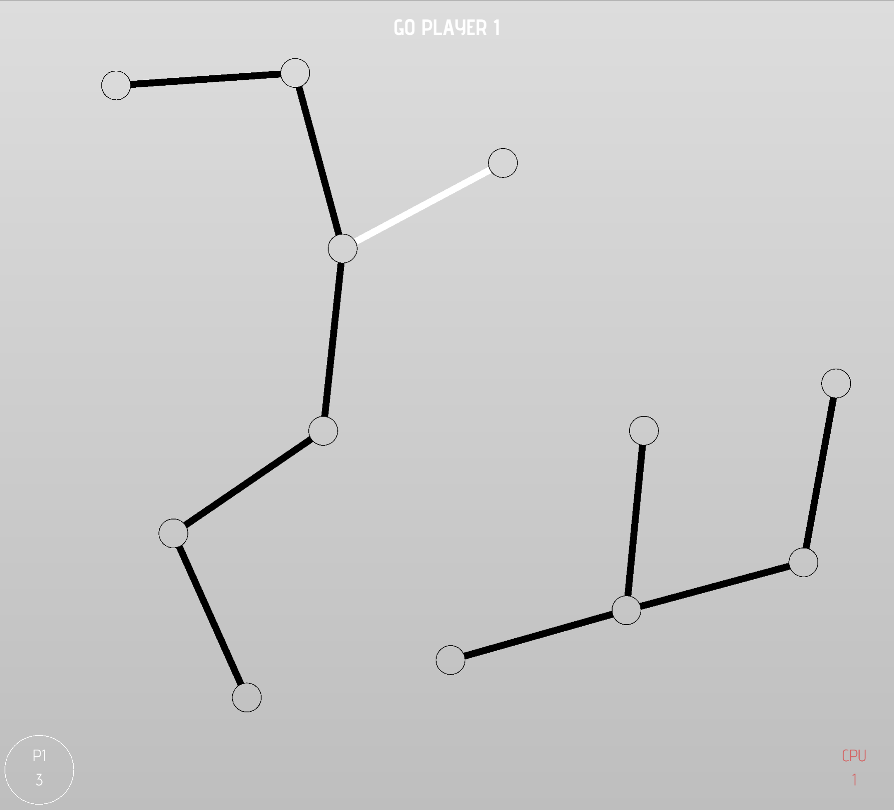

# The Shears of Atropos

This is an implementation of the Strings-and-Coins game, a graph variant of the Dots-and-Boxes game.

Hat tip to the book Winning Ways for Your Mathematical Plays.



# Folder structure

- `src` - source code for your kaplay project
- `dist` - distribution folder, contains your index.html, built js bundle and static assets

## Development

```sh
$ npm run dev
```

will start a dev server at http://localhost:8000

## Distribution

```sh
$ npm run build
```

will build into `dist/`

```sh
$ npm run zip
```
